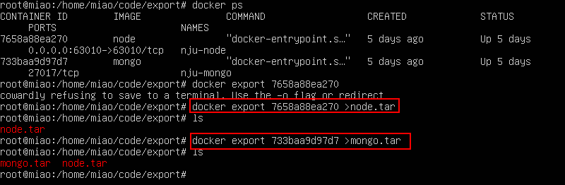

### 导出镜像
### 1. 进入希望放置导出包的目录
### 2. 查看导出容器的id
`docker ps -a`
### 3. 导出镜像
`docker export 7658a88ea270 >node.tar`，7658a88ea270是container id，node.tar是名字  
 

### 导入镜像
### 1. 进入放置导入包的目录
### 2. 导入镜像
`docker import - my-mongo <mongo.tar`
