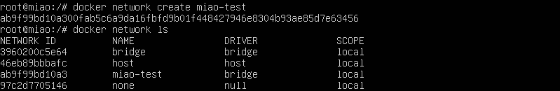

实现docker容器间的通信
#### 1. 新建内部网络
新建： `docker network create miao-test`  
展示： `docker network ls`  

#### 2. 新建项目文件夹
新建文件夹nju： `mkdir nju`  
新建文件夹nju的子文件夹nju-mongo：`mkdir nju-mongo` 
#### 3. 初始化node项目
在nju文件夹里初始化node：`npm init`  
新建index.js `vim index.js`  
安装包`npm install express --registry=https://registry.npm.taobao.org`、`npm install mongodb --registry=https://registry.npm.taobao.org`
#### 4.
