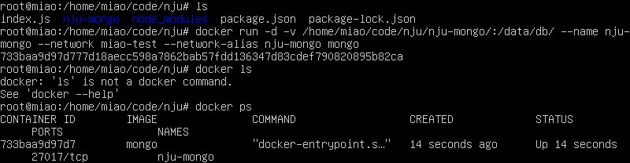

实现docker容器间的通信
#### 1. 新建内部网络
新建： `docker network create miao-test`  
展示： `docker network ls`  

#### 2. 新建项目文件夹
新建文件夹nju： `mkdir nju`  
新建文件夹nju的子文件夹nju-mongo：`mkdir nju-mongo` 
#### 3. 初始化node项目
在nju文件夹里初始化node：`npm init`  
新建index.js `vim index.js` 代码如下：   

  
安装包`npm install express --registry=https://registry.npm.taobao.org`、`npm install mongodb --registry=https://registry.npm.taobao.org`  

#### 4.开启mongo容器
开启：`docker run -d -v /home/miao/code/nju/nju-mongo/:/data/db/ --name nju-mongo --network miao-test --network-alias nju-mongo mongo`  
查看: `docker ps`  

#### 5.开启node容器
开启：`docker run -it -v /home/miao/code/nju/:/nju/ -p 0.0.0.0:63010:63010 --name=nju-node --network miao-test --network-alias nju-node node bash`  
查看: `docker ps`  

#### 6.测试两容器是否可以通信
`docker attach nju-node`、`ping -c 5 nju-mongo`，若有数据返回，则证明可以通信。（ctrl+c停止）

#### 7.测试应用程序
`curl -i localhost:63010`或`curl -i 0.0.0.0:63010`，若有数据返回，则证明可以通信。（ctrl+c停止）
