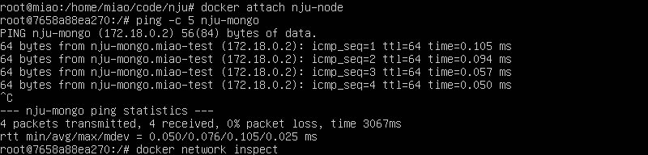

实现docker容器间的通信
#### 1. 新建内部网络
新建： `docker network create miao-test`  
展示： `docker network ls`  

#### 2. 新建项目文件夹
新建文件夹nju： `mkdir nju`  
新建文件夹nju的子文件夹nju-mongo：`mkdir nju-mongo` 
#### 3. 初始化node项目
在nju文件夹里初始化node：`npm init`  
新建index.js `vim index.js` 代码如下(连接的数据库改为了nju-mongo)：   

  
安装包`npm install express --registry=https://registry.npm.taobao.org`、`npm install mongodb --registry=https://registry.npm.taobao.org`  

#### 4.开启mongo容器
开启：`docker run -d -v /home/miao/code/nju/nju-mongo/:/data/db/ --name nju-mongo --network miao-test --network-alias nju-mongo mongo`  
查看: `docker ps`  
ps:①报错`docker: Error response from daemon: No command specified.`  
解决方案：命令后加`/bin/bash`,如`docker run -d -v /home/miao/code/nju/nju-mongo/:/data/db/ --name nju-mongo --network miao-test --network-alias nju-mongo mongo /bin/bash`
②秒退→添加it
`docker run -itd -v /home/miao/code/nju/nju-mongo/:/data/db/ --name nju-mongo --network miao-test --network-alias nju-mongo mongo /bin/bash`
③报错`Error connecting to 127.0.0.1:27017 :: caused by :: Connection refused :connect@src/mongo/shell/mongo.js:341:17`  
解决方案：进入容器启动服务`mongod --dbpath /data/db`

#### 5.开启node容器
开启：`docker run -it -v /home/miao/code/nju/:/nju/ -p 0.0.0.0:63010:63010 --name=nju-node --network miao-test --network-alias nju-node node bash`  
查看: `docker ps`  

#### 6.测试两容器是否可以通信
`docker attach nju-node`、`ping -c 5 nju-mongo`，若有数据返回，则证明可以通信。（ctrl+c停止）

#### 7.开启node服务
`docker exec -it nju-node /bin/bash`，进入nju文件夹，运行index.js,`node index.js`

#### 8.测试node代码
新建窗口（win + →），`curl -i 0.0.0.0:63010`,若返回OK，则证明代码可运行。否则可在node窗口查看报错信息，修改代码后重启容器（`docker restart nju-node`），再次测试。
  
`curl  0.0.0.0:63010/get-test`有和在浏览器中测试相同的效果
#### 9.浏览器端测试
查看本机端口`ifconfig`,ens33 中的inet为虚拟机ip，物理机浏览器输入`192.168.40.128:63010`即可查看端口。  

参考教程：https://tuture.co/2020/01/01/cd44c84/  
https://www.pianshen.com/article/69421182108/
