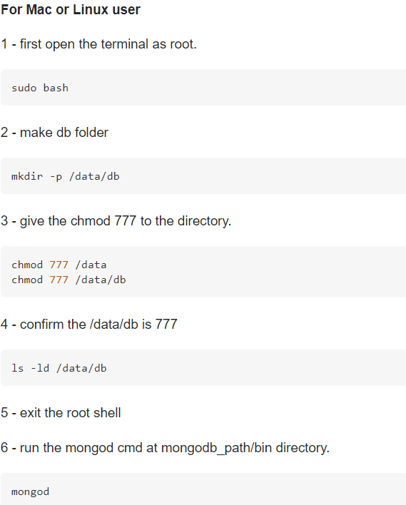
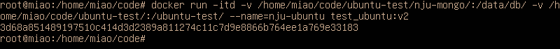

基于Ubuntu容器内实现mongo+node通信(探索的过程)
#### 1. 拉取ubuntu镜像
`docker pull ubuntu`  
#### 2. 启动ubuntu容器
`docker run -itd --name miao-ubuntu ubuntu`
#### 3. 进入容器
`docker exec -it miao-ubuntu bash`
#### 4. 安装sudo
`apt-get update`,`apt-get install sudo`
#### 5. 安装mongodb
`sudo apt install mongodb`  
`mongod`开启服务  
报错①输入`mongo`测试，connection attempt failed mongo.js:257:13  
解决方案：https://stackoverflow.com/questions/51812931/does-not-start-mongodb-4  
  
注：默认装的版本是3.6.8，想升级版本，参考教程如下  
https://mongodb.net.cn/manual/tutorial/install-mongodb-on-ubuntu/ ，https://blog.csdn.net/yutu75/article/details/110941936    
默认没安装wget,`apt install wget`。但是报错Unable to locate package mongodb-org，检查数遍无果遂放弃
#### 6. 安装node
`sudo apt-get install nodejs`,`sudo apt-get install npm`
#### 为映射文件夹，需要新建容器，但现有容器已下载了一些数据，故考虑先更新镜像，再基于更新后的镜像新建容器
#### 7. 更新镜像
`docker commit -m="has update" -a="miao" nju_ubuntu test_ubuntu:v2`  
https://www.runoob.com/docker/docker-image-usage.html
#### 8.映射文件夹
 `docker run -itd -v /home/miao/code/ubuntu-test/nju-mongo/:/data/db/ -v /home/miao/code/ubuntu-test/:/ubuntu-test/ --name=nju-ubuntu test_ubuntu:v2`  
 
#### 9.数据库建库，撰写后端代码，在此复制了以前的代码
#### 10.本机浏览器访问
①采用NAT模式，虚拟机`ifconfig`查看端口信息  
②物理机cmd输入`ROUTE -p add 172.17.0.0 mask 255.255.0.0 192.168.2.128`，具体参数参考下文连接  
https://www.huaweicloud.com/articles/cf9d2ffbfeefb2bfa275d5c7d9820899.html  
③虚拟机关闭防火墙`sudo ufw disable`  
④本机浏览器访问`http://172.17.0.2:63010/get-test`
#### 11.docker内安装adminMongo
`npm install -g admin-mongo`,安装路径为`usr/local/lib/node_modules/admin-mongo`  
https://www.aiuai.cn/aifarm1201.html
#### 12.运行adminMongo
`cd usr/local/lib/node_modules/admin-mongo`,`npm start`,由于服务启在docker内，物理机浏览器访问`http://172.17.0.2:1234`,即可进行界面化管理
#### 13.docker内安装code server
下载：`cd /home`,`wget https://github.com/cdr/code-server/releases/download/v3.9.1/code-server-3.9.1-linux-amd64.tar.gz`  
https://github.com/cdr/code-server/releases  
解压：`tar -xvzf code-server-3.9.1-linux-amd64.tar.gz`  
`mv code-server-3.9.1-linux-amd64 code-server`  
使代码服务器二进制可执行文件：`cd code-server`  
`chmod +x code-server`  
运行代码服务器：`./code-server --port 8000`
参考教程：https://bynss.com/codes/451806.html  
https://www.digitalocean.com/community/tutorials/how-to-set-up-the-code-server-cloud-ide-platform-on-ubuntu-18-04  
#### 14.在启动时运行代码服务器
`sudo apt install nano`,`nano /lib/systemd/system/code-server.service`    
将以下粘贴到文件,
`[Unit]
Description=Code Server Service  
After=network.target  

[Service]  
Type=simple  
Restart=on-failure  
RestartSec=10  
WorkingDirectory=/home/code-server/code-server  
Environment="PASSWORD=<password>"  
ExecStart=/home/code-server/code-server/code-server --port 8000  
StandardOutput=file:/var/log/code-server-output.log  
StandardError=file:/var/log/code-server-error.log  

[Install]  
WantedBy=multi-user.target`  
启用并启动新创建的服务,
`systemctl enable code-server
systemctl start code-server`
