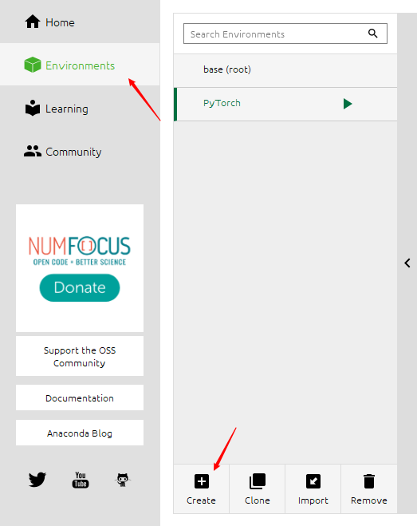
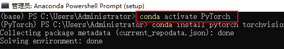
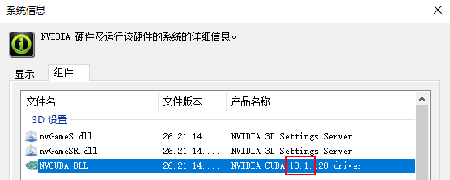
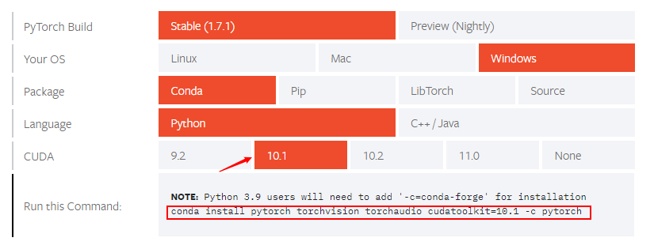

### 1. anaconda新建虚拟环境PyTorch
  
### 2. 激活虚拟环境
命令行输入`conda active PyTorch`  
   
注：若未设置环境变量，可参考 https://blog.csdn.net/mars_xiaolei/article/details/82798640
### 3. 安装PyTorch
①查看cuda版本
桌面右键→NVIDA控制面板→系统信息→组件→产品名称

②复制conda命令
进入PyTorch官网https://pytorch.org/get-started/locally/ ,选择目标系统配置，复制conda命令

