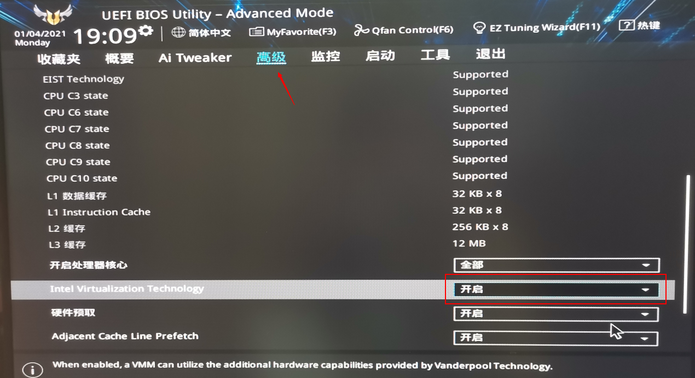

#### 1. 下载Ubuntu Server版
https://releases.ubuntu.com/20.04/  

#### 2. 新建虚拟机
打开VMWare,新建虚拟机→典型→稍后安装→Ubuntu 64位→命名→指定磁盘容量20G，单个文件→完成
#### 3. 编辑虚拟机设置
①处理器：1个4核; 勾选“虚拟化Intel VT-x/EPT 或AMD-V/RVI（v）”  
②CD/DVD→使用ISO映像文件，选择Ubuntu镜像的路径  
③网络适配器：NAT  
  

#### 问题1：出现提示：“此主机支持 Intel VT-x，但 Intel VT-x处于禁用状态。”
答：进入BIOS，开启Intel Virtualization Technology
以华硕电脑为例，F2进入BISO，进入高级→找到Intel Virtualization Technology，设置为enable，保存后退出即可  

补充教程：https://zhuanlan.zhihu.com/p/38797088
