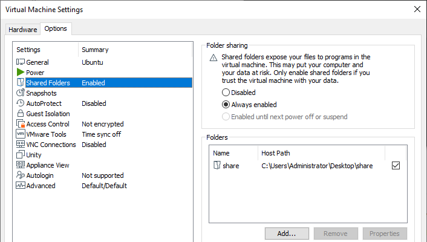

### 在仅有命令行界面的 Ubuntu 服务器中安装 VMware Tools
### 1.设置Windows共享文件夹
  
### 2.安装VMtools
VM→install VMtools
ps：若安装按钮为灰色：
①关闭虚拟机②设置CD/DVD为自动检测③重启虚拟机，按钮可用
### 3.挂载 CD-ROM
`mount -t iso9660 /dev/cdrom /mnt`
### 4.解压 VMwwre Tools 捆绑包
`tar xzvf /mnt/cdrom/VMwareTools-x.x.x-xxxx.tar.gz -C /tmp/`
### 5.安装 VMware Tools
`cd /tmp/vmware-tools-distrib/`  
`sudo ./vmware-install.pl -d`
### 6.安装完成后运行下面的命令重新启动虚拟机：
`sudo reboot`
### 7.linux共享文件夹地址
`cd /mnt/hgfs`
ps:若没有hgfs文件夹：
`mkdir hgfs`  
`sudo vmhgfs-fuse .host:/ /mnt/hgfs`
 
参考教程:
https://kb.vmware.com/s/article/1022525?lang=zh_CN  
https://stuff.mit.edu/afs/sipb/project/vmdialup/archive/i386_linux24.old/lib/vmware-console/help/esx/vmtools_install_linux.htm  
https://blog.csdn.net/theVicTory/article/details/72976164  
https://blog.csdn.net/qq_40259641/article/details/79022844  
https://www.jianshu.com/p/217e8cc316f3
